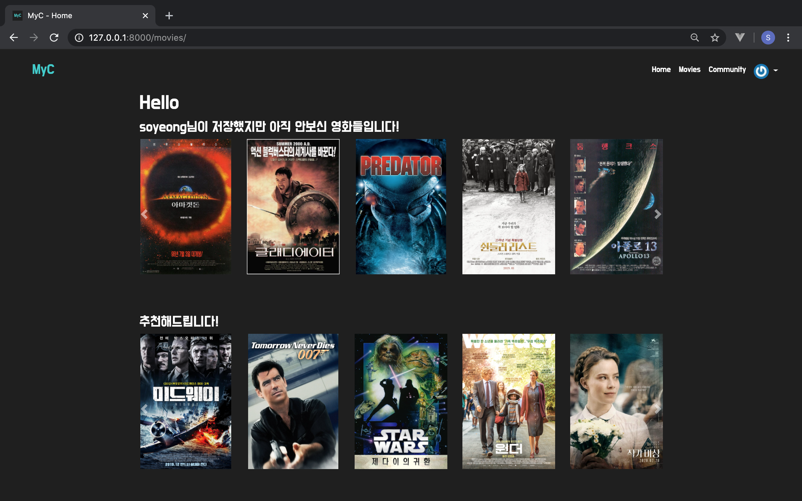
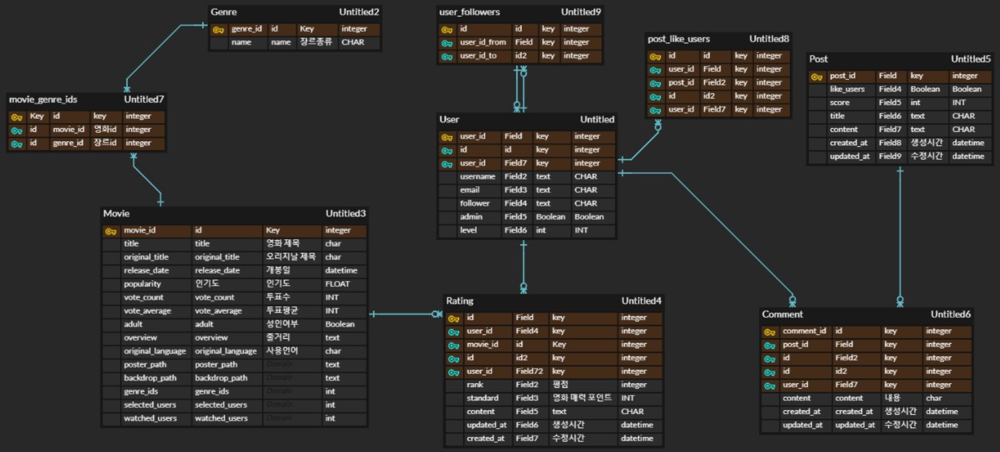

# Ssafy 1학기 종합 프로젝트

> 영화 정보 기반 추천 서비스 MyC

##### 개발 환경 

Python Web Framework

- Django 2.1.15
- Python 3.7.3

##### 개발 아키텍처

- Django & Vanila JS

##### 데이터 수집

- TMDB API를 통해 받아온 데이터를 통해 Database Seeding
- TMDB 내 popular 분류에 속해있는 1000개 영화 데이터 저장

##### 팀원 정보 및 업무 분담 내역

- 김소영(팀장) - 데이터 modeling, movies app, accounts app, UI구조 및 css
- 김석환(팀원) - 데이터 modeling, community app, UI구조 및 css

##### 개발 일정

2020.06.11(목) ~ 2020.06.17(수)

##### 메인화면 예시

###  목표 서비스 구현 및 실제 구현 정도 

1. 추천 알고리즘을 통한 영화 추천

   - 사용자의 입력 데이터(저장한 영화, 본 영화)를 기반으로 영화의 개봉년도, 국가, 장르별로 나누어 총 10개 영화 추천
   - 사용자의 List에 저장된 영화지만, 아직 안본 영화들의 정보를 메인 화면에 나열

2.  장르 필터를 통해 원하는 장르 선택

   -  Ajax를 활용한 비동기 요청을 통해 사용자 경험 향상
   - 나열된 영화들을 보면서 저장 및 본영화로 표시 가능, 영화를 누르면 영화에 대한 디테일 확인 가능

3. My Page에서 저장한 영화 확인 및 관리

   - 내가 저장한 영화 확인 및 관리
    =======

   - 내가 저장한 영화 확인 및 수정 가능

   - 상대방이 어떤 영화를 저장했는지 확인 가능

   - 팔로우 기능

4. 영화에 대한 평점 및 포스트 작성

   - 평점 작성

     - 좋아요/싫어요, 영화에 대한 매력 포인트(영상미, 배우연기, 감독연출, OST, 스토리), 한줄평 작성 가능
     - 작성한 사용자만이 글에 대한 수정, 삭제 가능
     - 생성 및 수정 시각 정보 표시

   - 포스트 작성

     - 영화에 대한 리뷰 작성 가능, 작성한 사용자만이 글에대한 수정, 삭제 가능

     - 작성한 포스트에 대하여 좋아요 및 댓글 생성 가능

     - 댓글은  댓글을 작성한 사용자만이 삭제 가능

     - 생성 및 수정 시각 정보 표시

       

###  데이터베이스 모델링(ERD)

###  필수 기능

- 사용자 로그인/ 회원가입 - 로그인 된 유저만 평점 등록 및 커뮤니티 기능 사용 가능
- 사용자 입력 데이터 기반으로 영화 추천
- 영화에 대한 평점 작성 및  CRUD
- 영화에 대한 커뮤니티 CRUD, 댓글 작성 CRD
- 메세지 활용하여 성공 및 에러에 대한 내용 사용자에게 전달
  - Notify.js 라이브러리 활용

 ### 배포 서버 URL

http://ec2-18-220-134-245.us-east-2.compute.amazonaws.com/movies/

 ### 기타(느낀점)

-  Django 및 Vanlia Js를 이용하여 영화 평점 기반 추천 홈페이지를 제작을 하면서 그 동안 Django 배운 모든 내용을 활용하였고, 좋아요와 팔로우 기능을 Vanlia Js를 활용하여 배운 내용도 활용을 하여 제작을 하였습니다. 뿐만 아니라, 기본적으로 배운 내용을 토대로 추가 기능을 설정할 수 있을 것을 생각해보고 추가하고, 제대로 css를 꾸민 적이 처음이어서 css 활용이 힘들었습니다. 그리고 팀프로젝트로 팀원과 구상부터 시작해서 서로 의견을 나누면서 프로젝트를 진행하였습니다. 프로젝트 기간동안 팀원한테 많이 배우기도 많이 배웠고 스스로도 가장 많은 것을 배운 프로젝트였습니다.